# Sinq (ስንቅ) — Library, Readers & Marks Architectural Redesign Specification

**Status**: Proposed Architecture & Design Specification  
**Design Standard**: `/impeccable` High-Craft Mobile UX / Material 3  
**Liturgical Tradition**: Ethiopian Orthodox Tewahedo Church (EOTC)  
**Target Codebase**: Jetpack Compose, Kotlin 2.1+, Android API 23–36  

---

## 1. Executive Summary & Vision

Sinq is a distraction-free, 100% offline liturgical companion for the Ethiopian Orthodox Tewahedo Church. While the technical foundations (data integrity, computus, font scaling, rubrication, zero-network security) are robust, the user interface across the **Library Hub**, the **six core readers**, and **Marks/Bookmarks** currently reflects an early, utilitarian phase of development. 

This redesign transforms Sinq into an authentic digital scriptorium:
1. **Sacred Visual Dignity**: Evoking the illuminated manuscript (*ብራና*) tradition through ornamental *ሐረግ* (Harag) headers, warm ivory reading grounds, deep sanctuary greens (`#0E3B31`), royal liturgical gold (`#E8C46B`), and strict rubrication (*ቀይ ጽሑፍ*).
2. **Context-Aware Liturgical Readiness**: Surfaces the right prayer, hour, reading, or commemoration according to the canonical hour of the day and liturgical season.
3. **Ergonomic Devotional Utility**: Incorporates interactive prayer aids (haptic prostration counters, chant mode chips, movement rails, antiphonal choir distinctions, and traditional silk ribbon bookmarks) without visual clutter.

---

## 2. Phased Architectural Decomposition

```mermaid
flowchart TD
    subgraph Phase1["Phase 1: Library & Scripture Hub"]
        L1["LibraryScreen.kt: Scriptorium Hero + Harag Cards"]
        L2["ScriptureHubScreen.kt: 81-Book Canon Codex Grid"]
        L3["BookShelfScreen.kt: Shelf Cards with Liturgical Badges"]
    end

    subgraph Phase2["Phase 2: Canonical Hours (መጽሐፈ ሰዓታት)"]
        H1["ReadingScreen.kt: Monastic Prostration Counter (መቁጠሪያ)"]
        H2["SectionUi.kt: Antiphonal Clergy Rubric Chips (ካህን/ዲያቆን/ሕዝብ)"]
        H3["ReadingScreen.kt: Canonical 7-Hour Quick-Jump Drawer"]
    end

    subgraph Phase3["Phase 3: Mahlet & Hymnology (ሥርዓተ ማኅሌት)"]
        M1["MahletScreen.kt: Ziq/Deggwa Musical Mode Tags (ግዕዝ/ዕዝል/አራራይ)"]
        M2["MahletScreen.kt: Sticky Movement Jump Rail (ነግሥ/ዚቅ/ወረብ/ሰላም)"]
        M3["MahletScreen.kt: Antiphonal Choir Layout (መሪጌታ vs ተመሪ)"]
    end

    subgraph Phase4["Phase 4: Scripture & Psalter (መጽሐፍ ቅዱስ & ዳዊት)"]
        S1["ScriptureReaderScreen.kt: Illuminated Ge'ez Drop-Caps"]
        S2["ScriptureReaderScreen.kt: Inline Cross-Reference & Catena Bubbles"]
        S3["PsalterScreen.kt: 15 Biblical Canticles (፲፭ቱ ነቢያት)"]
        S4["PsalterScreen.kt: Spiritual Intention Thematic Index (ንስሐ/ምስጋና)"]
    end

    subgraph Phase5["Phase 5: Synaxarium & Devotions (ስንክሳር & ውዳሴ ማርያም)"]
        D1["SynaxariumScreen.kt: Daily Saint Hero Commemoration Card"]
        D2["SynaxariumScreen.kt: Arke (አርኬ) Poetry Highlight Box"]
        D3["WudaseMaryamScreen.kt: Refrain Anchor Dimming & Melkea Outline"]
    end

    subgraph Phase6["Phase 6: Marks, Bookmarks & Quotes (ምልክቶቼ)"]
        K1["MarksScreen.kt: Traditional Woven Silk Ribbons (የብራና ድርድር)"]
        K2["MarksScreen.kt: Prayer Intention Collections (ለሕሙማን/ንስሐ)"]
        K3["SectionUi.kt: Illuminated Manuscript Quote Card Generator"]
    end

    Phase1 --> Phase2
    Phase2 --> Phase3
    Phase3 --> Phase4
    Phase4 --> Phase5
    Phase5 --> Phase6
```

---

## 3. Section-by-Section: Current vs. Proposed

### Section 1: ቤተ መጻሕፍት (Library Hub & Shelves)

#### 1.1 Current Architecture ([LibraryScreen.kt](file:///home/natinael/Desktop/project/---sinq/app/src/main/java/com/agpeya/app/ui/library/LibraryScreen.kt))
- Single vertical `LazyColumn` containing uniform `SinqCard` components.
- Generic material outline icons (`MenuBook`, `AutoStories`, `Favorite`, `BookmarkBorder`).
- No awareness of the current reader position or active devotional state.
- Shelves are isolated, requiring multiple taps to determine book counts and seasonal feasts.

#### 1.2 Proposed Architecture
1. **Scriptorium Quick-Resume Banner ("ቀጥል")**:
   - Elevated top card displaying the last read location (e.g., *መጽሐፈ ሰዓታት — ሠርክ*, *መዝሙረ ዳዊት ፺፩*, or *ስንክሳር ፳፭ መጋቢት*).
   - Shows active completion percentage and estimated remaining prayer time.
2. **Illuminated Harag Ornamentation**:
   - Corner brackets and subtle card frames based on traditional Ethiopian illuminated manuscripts.
   - Distinct emerald, gold, and ruby accents denoting Scripture, Liturgy, and Tradition.
3. **Dynamic Liturgical Badges**:
   - Live date and season badges (e.g., *የዛሬው ውዳሴ: ሰኞ*, *የዕለቱ ስንክሳር: ፳፭ መጋቢት*, *የጾም ወቅት: ዐቢይ ጾም*).

---

### Section 2: መጽሐፈ ሰዓታት (Horologium / Seven Canonical Hours)

#### 2.1 Current Architecture ([ReadingScreen.kt](file:///home/natinael/Desktop/project/---sinq/app/src/main/java/com/agpeya/app/ui/reading/ReadingScreen.kt))
- Reads sections through `LazyColumn` or `HorizontalPager`.
- Auto-immersion distraction-free mode hides top/bottom bars on scroll.
- Bookmarks exist only on section headers.
- Canonical hour switching is locked behind a plain dropdown text menu.

#### 2.2 Proposed Architecture
1. **Interactive Monastic Prostration Counter (መቁጠሪያ / Metanyas Counter)**:
   - For recurring liturgical litanies (e.g. *ኪሪያላይሶን ፵፩ ጊዜ*, *አቡነ ዘበሰማያት*, *ስግደት*), a tactile circular counter appears in the lower margin.
   - Tapping increments the counter with gentle haptic ticks (`HapticFeedbackType.TextHandleMove`) and Ge'ez numeral progression until 12 or 41 is reached.
2. **Clergy & People Rubric Badges**:
   - Clergy directives (*ይበል ካህን*, *ይበል ዲያቆን*, *ይበሉ ሕዝብ*) styled with distinct pill badges in traditional red ink (*ቀይ ጽሑፍ*) rather than standard inline text.
3. **Visual Canonical Hours Rail**:
   - A swipe-down or header-tap bottom sheet illustrating the seven liturgical hours with day/night astrological-liturgical icons:
     - *ነግሕ* (Dawn, 1st hour)
     - *ሠለስት* (3rd hour)
     - *ስድስት* (Midday, 6th hour)
     - *ተስዐት* (9th hour)
     - *ሠርክ* (Sunset, 11th hour)
     - *ነዋም* (Bedtime / Compline, 12th hour)
     - *መንፈቀ ሌሊት* (Midnight Vigil)

---

### Section 3: ሥርዓተ ማኅሌት (Mahlet Feast Orders)

#### 3.1 Current Architecture ([MahletScreen.kt](file:///home/natinael/Desktop/project/---sinq/app/src/main/java/com/agpeya/app/ui/mahlet/MahletScreen.kt))
- Linear vertical scrolling of all movements (*ነግሥ*, *ዚቅ*, *ወረብ*, *አመላለስ*, *ሰላም*).
- Long feasts span 40+ stanzas with no fast-forward navigation.
- Chant musical modes are not visually distinguished.

#### 3.2 Proposed Architecture
1. **Chant Mode Identifiers (የዜማ ስልት - ግዕዝ / ዕዝል / አራራይ)**:
   - Visual color-coded rubric chips denoting Yaredic notation modes:
     - **ግዕዝ (Ge'ez)**: Liturgical Gold / Ochre
     - **ዕዝል (Ezel)**: Royal Crimson / Burgundy
     - **አራራይ (Araray)**: Deep Lapis / Indigo
2. **Sticky Movement Navigation Rail (የክፍሎች መዝለያ)**:
   - Floating pill navigation bar anchored at bottom: `[ ነግሥ | ዚቅ | ወረብ | አመላለስ | ሰላም ]` enabling immediate jumping to any movement without manual scrolling.
3. **Antiphonal Choir Hierarchy**:
   - Visual distinction between soloist/choirmaster (*መሪጌታ*) and response choir (*ተመሪ*).

---

### Section 4: መጽሐፍ ቅዱስ & መዝሙረ ዳዊት (Scripture & Psalter)

#### 4.1 Current Architecture ([ScriptureReaderScreen.kt](file:///home/natinael/Desktop/project/---sinq/app/src/main/java/com/agpeya/app/ui/library/ScriptureReaderScreen.kt), [PsalterScreen.kt](file:///home/natinael/Desktop/project/---sinq/app/src/main/java/com/agpeya/app/ui/psalter/PsalterScreen.kt))
- Standard verse lists with horizontal chapter selector.
- Psalter covers Monday to Saturday with Sunday left unaddressed or routed to shelf.
- Cross references and commentaries are buried in selection sheets.

#### 4.2 Proposed Architecture
1. **The 81-Book Ethiopian Canon Codex Navigator**:
   - Grouping books by Orthodox canon divisions:
     - **ኦሪትና ታሪክ** (Octateuch, Jubilees / *ኩፋሌ*, Enoch / *ሄኖክ*)
     - **ነገሥትና መቃብያን** (Historical, Meqabyan 1–3 / *መቃብያን*)
     - **መጻሕፍተ ጥበብ** (Wisdom of Solomon, Sirach)
     - **ነቢያት** (Prophets)
     - **ወንጌል** (4 Gospels)
     - **መልእክታትና ራእይ** (Epistles, Clement / *ቀሌምንጦስ*, Didascalia, Revelation)
2. **The 15 Biblical Canticles (፲፭ቱ የነቢያት ጸሎት)**:
   - Seamlessly integrated as the 8th tab of the Psalter: *ጸሎተ ሙሴ, ጸሎተ ሐና, ጸሎተ ዕንባቆም, ጸሎተ ኢሳይያስ*, and *መኃልየ መኃልይ ዘሰሎሞን*.
3. **Spiritual Intention Quick Filter**:
   - Categorized index for liturgical needs: *የንስሐ መዝሙራት* (Psalms of Repentance: 6, 32, 38, 51, 102, 130, 143), *የጥበቃ* (Protection: 23, 27, 91), *የምስጋና* (Thanksgiving: 103, 148, 150).
4. **Illuminated Calligraphic Drop-Caps**:
   - Traditional Ge'ez initial letters with illuminated red filigree.

---

### Section 5: መጽሐፈ ስንክሳር & ውዳሴ ማርያም (Synaxarium & Marian Office)

#### 5.1 Current Architecture ([SynaxariumScreen.kt](file:///home/natinael/Desktop/project/---sinq/app/src/main/java/com/agpeya/app/ui/gitsawe/SynaxariumScreen.kt), [WudaseMaryamScreen.kt](file:///home/natinael/Desktop/project/---sinq/app/src/main/java/com/agpeya/app/ui/library/WudaseMaryamScreen.kt))
- Plain vertical feed of daily saint accounts with red Arke verse.
- Day navigation requires opening a full date dialog.
- Repeated refrains in Wudase Maryam create visual clutter.

#### 5.2 Proposed Architecture
1. **Saint Commemoration Hero Card**:
   - Prominent illuminated card for the primary feast of the day with category badges (*የጌታ በዓል, የእመቤታችን, ሰማዕት, ጻድቅ, ሊቀ ጳጳስ*).
2. **Arke (አርኬ) Sacred Poetry Framing**:
   - Set in a distinct parchment callout card with decorative Ge'ez quotation marks and liturgical red ink.
3. **Horizontal Day Swiping**:
   - Fluid horizontal swipe navigation between *ትናንት*, *ዛሬ*, and *ነገ*.
4. **Refrain Chorus Pacer**:
   - Softly dimmed recurring Marian refrains (*"ኦ እግዝእትየ አዕርጊ ጸሎተነ..."*) to maintain rhythm without exhausting the eye.

---

### Section 6: ምልክቶቼ (Bookmarks, Ribbons & Image Cards)

#### 6.1 Current Architecture ([MarksScreen.kt](file:///home/natinael/Desktop/project/---sinq/app/src/main/java/com/agpeya/app/ui/marks/MarksScreen.kt))
- Three tabs: Bookmarks, Highlights, Notes.
- Flat lists of citations; export is a plain `.txt` file dump.
- Highlights restricted to 4 basic colors.

#### 6.2 Proposed Architecture
1. **Woven Silk Ribbon Bookmarks (የብራና መጽሐፍ ድርድር ጥልፍ ሪባን)**:
   - Inspired by the traditional four-ribbon silk bookmarks woven into Ethiopian leather bindings.
   - Readers can name and pin custom ribbons:
     - 🔴 **ቀይ ድርድር (Crimson)**: Active canonical hour
     - 🟡 **ወርቃማ ድርድር (Gold)**: Daily Psalter portion
     - 🟢 **አረንጓዴ ድርድር (Emerald)**: Current Scripture reading
     - 🔵 **ሰማያዊ ድርድር (Sapphire)**: Sinksar commemoration
2. **Prayer Intention Collections (የጸሎት አቃፊዎች)**:
   - Group marks and highlights into intention folders: *ለሕሙማን*, *ለሀገር ሰላም*, *የንስሐ*, *የዕለት ጸሎት*.
3. **Sacred Illuminated Quote-Card Generator**:
   - One-tap creation of high-resolution shareable quote images with parchment texture, Harag headers, Ethiopian crosses (`✝`), and verified liturgical citations for WhatsApp and Telegram status sharing.

---

## 4. Design Tokens & Typographic Hierarchy

| Token Name | Light (Parchment Ivory) | Dark (Monastic Charcoal) | Sanctuary Green (`hero`) |
| :--- | :--- | :--- | :--- |
| `background` | `#FDFBF7` (Unbleached Vellum) | `#121413` (Basalt Stone) | `#0E3B31` (Liturgical Emerald) |
| `surface` | `#F5F2EA` (Pressed Parchment) | `#1A1D1B` (Night Slate) | `#144A3E` (Deep Forest) |
| `primary` | `#0E3B31` (Deep Liturgical Green) | `#E8C46B` (Illuminated Gold) | `#E8C46B` (Illuminated Gold) |
| `secondary` | `#8C6D23` (Antique Bronze) | `#D4AF37` (Muted Gold) | `#D4AF37` (Muted Gold) |
| `rubricRed` | `#B3261E` (Crimson Ink) | `#E06D67` (Luminous Rubric) | `#FF8A80` (High-Contrast Red) |
| `textPrimary` | `#1C1B1F` (Carbon Black) | `#E3E3DC` (Ivory White) | `#FDFBF7` (Parchment White) |
| `textSecondary` | `#49454F` (Charcoal Muted) | `#A3A29B` (Stone Grey) | `#C2D6CF` (Soft Sage) |
